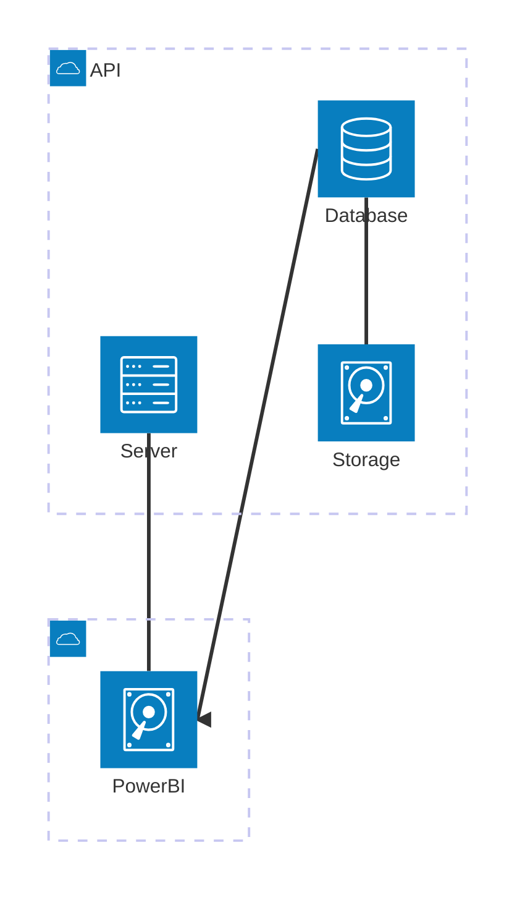
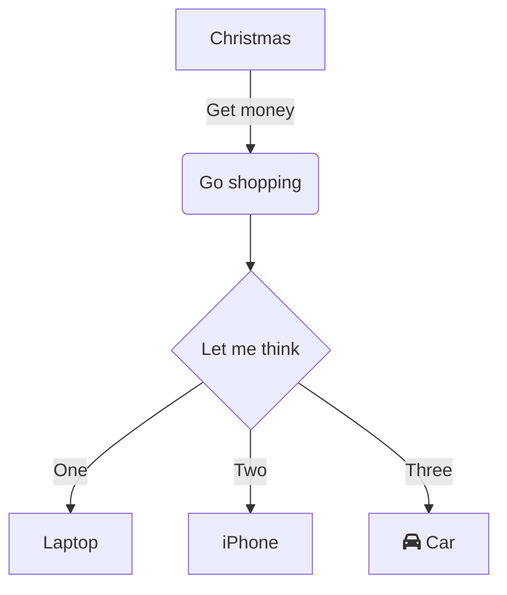
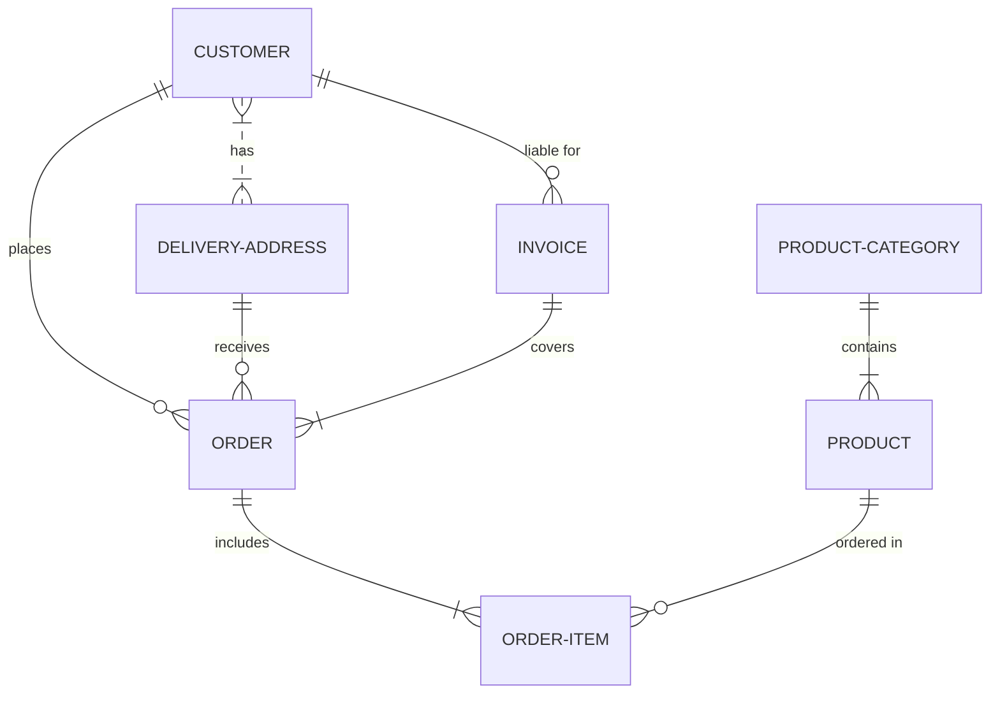
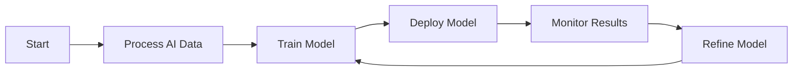

---
# the default layout is 'page'
layout: post
icon: fa-solid fa-toilet-paper
order: 5
toc: true
mermaid: true
---

### [<i class="fas fa-database"></i>&ensp; Vega & Vega-Lite Data Source Repo &ensp; <i class="fas fa-external-link-alt"></i>](https://github.com/vega/vega/tree/main/docs/data)


### Step <i class="fa-solid fa-1"></i>&ensp;

#### Step <i class="fa-solid fa-1"></i>&ensp;

## icons
## <i class="fa-solid fa-chart-line" aria-hidden="true"></i>&ensp; Level2

## <i class="fa-solid fa-square-poll-vertical" aria-hidden="true"></i>&ensp;Level3

## <i class="fa-solid fa-code" aria-hidden="true"></i>&ensp;Level4

## <i class="fa-solid fa-brain" aria-hidden="true"></i>&ensp;Brain

## <i class="fa-solid fa-skull-crossbones" aria-hidden="true"></i>&ensp;SkullCrossbones

## <i class="fa-solid fa-person-digging" aria-hidden="true"></i>&ensp;digging

## <i class="fa-solid fa-magnifying-glass-chart" aria-hidden="true"></i>&ensp;chart-look

## <i class="fa-solid fa-hands-clapping" aria-hidden="true"></i>&ensp;hands

## <i class="fa-solid fa-toilet-paper" aria-hidden="true"></i>&ensp;bog-roll

## <i class="fa-solid fa-file-code" aria-hidden="true"></i>&ensp;chart-look

## <i class="fa-solid fa-file-code"></i>

## <i class="fa-solid fa-pepper-hot" aria-hidden="true"></i>&ensp;Pepper
## <i class="fa-solid fa-smoking" aria-hidden="true"></i>&ensp;Smoking

## <i class="fa-solid fa-laptop-code" aria-hidden="true"></i>&ensp;Level5

## <i class="fa-solid fa-face-laugh-wink" aria-hidden="true"></i>&ensp;Level6


[Link button](https://pbi-datavizzle.github.io/){: .btn }


```diff
SELECT 
t.column1
-, t.column2
, t.column3
FROM table1 as t
no removal
+ newline
- removed line
```
{: .nolineno }

<div class="thi-columns" markdown="1">

## lists

### bullets

- item 1
- item 2
- item 3
- item 4
- item 5
- item 6
</div>

___

Click on the @icn-camera icon to take a screen shot.

Click on the @icon-camera icon to take a screen shot.

[Visit Blog ## <i class="fas fa-external-link-alt"></i>](https://blog.markdowntools.com/)

> ## <i class="fa-solid fa-person-digging fa-2x" style="color: orange"></i> Configuration
> Configuration can be launched from the **Tools -> Settings** menu option.

<p>Used on a button:</p>
<button style="font-size:24px">Button <i class="fa fa-spinner"></i></button>


<br>

> **My Python Script**
```python
def hello():
    print("Hello, world!")
```

<br>


```jsonc
{
  "data": {"name": "dataset"}
  // comments
  /* json comments */
  ...
}

```

[link to check box](#check-boxes)










<br>


```json
{
  "$schema": "https://vega.github.io/schema/vega-lite/v5.json",
  "description": "Reproducing http://robslink.com/SAS/democd91/pyramid_pie.htm",
  "data": {
    "values": [
      {"category": "Sky", "value": 75, "order": 3},
      {"category": "Shady side of a pyramid", "value": 10, "order": 1},
      {"category": "Sunny side of a pyramid", "value": 15, "order": 2}
    ]
  },
  "mark": {"type": "arc", "outerRadius": 80},
  "encoding": {
    "theta": {
      "field": "value", "type": "quantitative",
      "scale": {"range": [2.35619449, 8.639379797]},
      "stack": true
    },
    "color": {
      "field": "category", "type": "nominal",
      "scale": {
        "domain": ["Sky", "Shady side of a pyramid", "Sunny side of a pyramid"],
        "range": ["#416D9D", "#674028", "#DEAC58"]
      },
      "legend": {
        "orient": "none",
        "title": null,
        "columns": 1,
        "legendX": 200,
        "legendY": 80
      }
    },
    "order": {
      "field": "order"
    }
  }
}

```

<br>


| Column 1       | Column 2                                   |
| -------------- | ------------------------------------------ |
| Example JSON 1 | `{ "name": "Alice", "age": 25 }`           |
| Example JSON 2 | `{ "city": "New York", "country": "USA" }` |


| Column 1       | Column 2                                          |
| -------------- | ------------------------------------------------- |
| Example JSON 1 | ```json {"name": "Alice", "age": 25}```           |
| Example JSON 2 | ```json {"city": "New York", "country": "USA"}``` |


<table border="1">
  <tr>
    <td>Code Block 1</td>
    <td>Code Block 2</td>
  </tr>
  <tr>
    <td>
      <pre><code class="language-diff">
      { "data": {"name": "dataset"} } 
      </code></pre> 
    </td> 
    <td> 
      <pre><code class="language-diff"> 
      { "data": 
      + {"name": "dataset"} 
      } 
    </code></pre> 
    </td> 
    </tr>

</table>


```sql
SELECT 
t.column1
, t.column2
, t.column3
FROM table1 as t
```
{: .nolineno }

```sql
SELECT 
t.column1
, t.column2
, t.column3
FROM table1 as t
```


> **ℹ️ Note**: Here's a small note for reference.
{: .prompt-note }

> **💀 Note**: Here's a small note for reference.
{: .prompt-note }

> **⚠️ Note**: Here's a small note for reference.
{: .prompt-note }

> **⛔ Note**: Here's a small note for reference.
{: .prompt-note }

> This is an example of a Tip.
{: .prompt-tip }

> This is an example of an Info block.
{: .prompt-info }

> This is an example of a Warning block.
{: .prompt-warning }

> This is an example of a Danger block.
{: .prompt-danger }

[//]: # Collapsable Section


### dax highlighter 
```dax title= "dax title"
Distinct Vertices Label Prop = 
CALCULATE( 
  COUNTROWS( DISTINCT( 'Vertices Label Prop'[id] ) )
  , 'Vertices Label Prop'[Type] in {"User", "Group"} 
)
```


```powerquery
let
  source = "sample text using prism.js"
in
  source
```


```fsharp
// power query code
Table.AddColumn(
  v_date_serial, 
  "rec_year", 
  each [
    calendar_year        = Date.Year([date_id]), 
    current_year         = Date.Year(v_current_date), 
    calendar_year_offset = calendar_year - current_year, 
    is_year_complete     = if Date.EndOfYear([date_id]) < Date.EndOfYear(v_current_date) then 1 else 0, 
    is_cmtd              = if ([date_id] <= Date.AddDays(Date.StartOfMonth(Date.From(v_current_date)), - 1)) then 1 else 0, 
    is_ytd               = if ([date_id] <= Date.From(v_current_date)) then 1 else 0, 
    is_frc               = if ([date_id] > Date.From(v_current_date)) then 1 else 0
  ], 
  type [
    calendar_year        = Int64.Type, 
    calendar_year_offset = Int64.Type, 
    is_year_complete     = Int64.Type, 
    is_cmtd              = Int64.Type, 
    is_ytd               = Int64.Type, 
    is_frc               = Int64.Type
  ]
)
```

```swift
// power query code
Table.AddColumn(
  v_date_serial, 
  "rec_year", 
  each [
    calendar_year        = Date.Year([date_id]), 
    current_year         = Date.Year(v_current_date), 
    calendar_year_offset = calendar_year - current_year, 
    is_year_complete     = if Date.EndOfYear([date_id]) < Date.EndOfYear(v_current_date) then 1 else 0, 
    is_cmtd              = if ([date_id] <= Date.AddDays(Date.StartOfMonth(Date.From(v_current_date)), - 1)) then 1 else 0, 
    is_ytd               = if ([date_id] <= Date.From(v_current_date)) then 1 else 0, 
    is_frc               = if ([date_id] > Date.From(v_current_date)) then 1 else 0
  ], 
  type [
    calendar_year        = Int64.Type, 
    calendar_year_offset = Int64.Type, 
    is_year_complete     = Int64.Type, 
    is_cmtd              = Int64.Type, 
    is_ytd               = Int64.Type, 
    is_frc               = Int64.Type
  ]
)
```


### dax highlighter 
```ruby
Distinct Vertices Label Prop = 
CALCULATE( 
  COUNTROWS( DISTINCT( 'Vertices Label Prop'[id] ) )
  , 'Vertices Label Prop'[Type] in {"User", "Group"} 
)
```

## check boxes

### check boxes
- [ ] check1
- [x] check2

### terms
Define a Term
: definition

> [!NOTE]  
Highlights information that users should take into account, even when skimming.

> [!IMPORTANT]  
> Crucial information necessary for users to succeed.

> [!WARNING]  
> Critical content demanding immediate user attention due to potential risks.


> **Note**
> This is a note

> **Warning**
> This is a warning

---

## Simple alerts
> [!NOTE]
> This is a note.

> [!TIP]
> This is a tip. (Supported since 14 Nov 2023)

> [!IMPORTANT]
> Crutial information comes here.

> [!CAUTION]
> Negative potential consequences of an action. (Supported since 14 Nov 2023)

> [!WARNING]
> Critical content comes here.

---

> **⚠️ Warning**
>
> You shouldn't. This is irreversible!

> **❌ Error**
>
> Don't do that. This is irreversible!

> **ℹ️ Information**
>
> You can do that without problem.

> **✅ Success**
>
> Don't hesitate to do that.

> **🦄 New line support**
> 
> It supports new lines:
>
> .. simply use an empty `>` line

{::options parse_block_html="true" /}
  <details><summary markdown="span"><b><i class="fa-solid fa-laptop-code" aria-hidden="true" style="color: orange"></i>&ensp;Dropdown</b></summary>

<br>

```jsonc

{ // WRITTEN IN DROPDOWN
    $schema: "https://vega.github.io/schema/vega-lite/v5.json",
    description: "A simple bar chart with embedded data.",
    data: {
      values: [
        {a: "A", b: 28}, /* comments */
        {a: "B", b: 55}, // comments2
        {a: "I", b: 52}
      ]
    },
    mark: "bar",
    encoding: {
      x: {field: "a", type: "ordinal"},
      y: {field: "b", type: "quantitative"}
    }
  }

```

  </details>
{::options parse_block_html="false" /}

<br>

```jsonc

{ // WRITTEN IN MARKDOWN
    $schema: "https://vega.github.io/schema/vega-lite/v5.json",
    description: "A simple bar chart with embedded data.",
    data: {
      values: [
        {a: "A", b: 28}, /* comments */
        {a: "B", b: 55}, // comments2
        {a: "C", b: 43},
        {a: "D", b: 91},
        {a: "E2", b: 81},
        {a: "F", b: 53},
        {a: "G", b: 19},
        {a: "H", b: 87},
        {a: "I", b: 52}
      ]
    },
    mark: "bar",
    encoding: {
      x: {field: "a", type: "ordinal"},
      y: {field: "b", type: "quantitative"}
    }
  }

```

<br>

{::options parse_block_html="true" /}
<details><summary markdown="span"><b><i class="fa-solid fa-laptop-code" aria-hidden="true" style="color: orange"></i>&ensp;Reveal Code: HTML</b></summary>


```html
<html>
<div id="vis0"></div>
  <script type="text/javascript">
    var spec = {
      $schema: 'https://vega.github.io/schema/vega-lite/v5.json',
      description: 'A simple bar chart with embedded data.',
      width: 400,
      height: 200,
      data: {
        values: [
          {a: 'A', b: 28},
          {a: 'B', b: 55},
          {a: 'C', b: 43},
          {a: 'D', b: 91},
          {a: 'E', b: 81},
          {a: 'F', b: 53},
          {a: 'G', b: 19},
          {a: 'H', b: 87},
          {a: 'I', b: 52}
        ]
      },
      mark: 'bar',
      encoding: {
        x: {field: 'a', type: 'ordinal'},
        y: {field: 'b', type: 'quantitative'}
      }
    };
    vegaEmbed('#vis0', spec);
  </script>
</html>
```
</details>
{::options parse_block_html="false" /}

<br>


{::options parse_block_html="true" /}
<details><summary markdown="span"><b><i class="fa-solid fa-laptop-code" aria-hidden="true" style="color: orange"></i>&ensp;Reveal Code: VEGALITE</b></summary>


<html>
<div id="visVL"></div>
  <script type="text/javascript">
    var spec = {
  "$schema": "https://vega.github.io/schema/vega-lite/v5.json",
  "description": "Multi-series line chart with labels and interactive highlight on hover.  We also set the selection's initial value to provide a better screenshot",
  "data": {"url": "https://raw.githubusercontent.com/vega/vega/refs/heads/main/docs/data/stocks.csv"},
  "transform": [{"filter": "datum.symbol!=='IBM'"}],
  "encoding": {
    "x": {"field": "date", "type": "temporal", "title": "date"},
    "y": {"field": "price", "type": "quantitative", "title": "price"},
    "color": {
      "condition": {
        "param": "hover",
        "field":"symbol",
        "type":"nominal",
        "legend": null
      },
      "value": "grey"
    },
    "opacity": {
      "condition": {
        "param": "hover",
        "value": 1
      },
      "value": 0.2
    }
  },
  "layer": [{
    "description": "transparent layer to make it easier to trigger selection",
    "params": [{
      "name": "hover",
      "value": [{"symbol": "AAPL"}],
      "select": {
        "type": "point",
        "fields": ["symbol"],
        "on": "pointerover"
      }
    }],
    "mark": {"type": "line", "strokeWidth": 8, "stroke": "transparent"}
  }, {
    "mark": "line"
  }, {
    "encoding": {
      "x": {"aggregate": "max", "field": "date"},
      "y": {"aggregate": {"argmax": "date"}, "field": "price"}
    },
    "layer": [{
      "mark": {"type": "circle"}
    }, {
      "mark": {"type": "text", "align": "left", "dx": 4},
      "encoding": {"text": {"field":"symbol", "type": "nominal"}}
    }]
  }],
  "config": {"view": {"stroke": null}}
};
    vegaEmbed('#visVL', spec);
  </script>
</html>

</details>
{::options parse_block_html="false" /}


<p></p>


{::options parse_block_html="true" /}
<details><summary markdown="span"><b><i class="fa-solid fa-laptop-code" aria-hidden="true" style="color: orange"></i>&ensp;Reveal Code: VEGALITE</b></summary>


<html>
  <div id="visVL2"></div>
  <script type="text/javascript">
    var spec = {
      "$schema": "https://vega.github.io/schema/vega-lite/v5.json",
      "description": "Multi-series line chart with labels and interactive highlight on hover.",
      "data": {"url": vega_repo + "data/stocks.csv"},
      "transform": [{"filter": "datum.symbol!=='IBM'"}],
      "encoding": {
        "x": {"field": "date", "type": "temporal", "title": "date"},
        "y": {"field": "price", "type": "quantitative", "title": "price"},
        "color": {
          "condition": {
            "param": "hover",
            "field":"symbol",
            "type":"nominal",
            "legend": null
          },
          "value": "grey"
        },
        "opacity": {
          "condition": {
            "param": "hover",
            "value": 1
          },
          "value": 0.2
        }
      },
      "layer": [
        {
          "description": "transparent layer to make it easier to trigger selection",
          "params": [{
            "name": "hover",
            "value": [{"symbol": "AAPL"}],
            "select": {
              "type": "point",
              "fields": ["symbol"],
              "on": "pointerover"
            }
          }],
          "mark": {"type": "line", "strokeWidth": 8, "stroke": "transparent"}
        },
        {
          "mark": "line"
        },
        {
          "encoding": {
            "x": {"aggregate": "max", "field": "date"},
            "y": {"aggregate": {"argmax": "date"}, "field": "price"}
          },
          "layer": [
            {"mark": {"type": "circle"}},
            {
              "mark": {"type": "text", "align": "left", "dx": 4},
              "encoding": {"text": {"field":"symbol", "type": "nominal"}}
            }
          ]
        }
      ],
      "config": {"view": {"stroke": null}}
    };

    vegaEmbed('#visVL2', spec);
  </script>
</html>


</details>
{::options parse_block_html="false" /}


<br>

<p></p>

<html>
<div id="vis0"></div>
  <script type="text/javascript">
    var spec = {
      $schema: 'https://vega.github.io/schema/vega-lite/v5.json',
      description: 'A simple bar chart with embedded data.',
      width: 400,
      height: 200,
      data: {
        values: [
          {a: 'A', b: 28},
          {a: 'B', b: 55},
          {a: 'C', b: 43},
          {a: 'D', b: 91},
          {a: 'E', b: 81},
          {a: 'F', b: 53},
          {a: 'G', b: 19},
          {a: 'H', b: 87},
          {a: 'I', b: 52}
        ]
      },
      mark: 'bar',
      encoding: {
        x: {field: 'a', type: 'ordinal'},
        y: {field: 'b', type: 'quantitative'}
      }
    };
    vegaEmbed('#vis0', spec);
  </script>
</html>

<br>

--- 

<html>
<div id="vis1"></div>
  <script type="text/javascript">
    var spec = {
      $schema: 'https://vega.github.io/schema/vega-lite/v5.json',
      description: 'A simple bar chart with embedded data.',
      width: 400,
      height: 200,
      data: {
        values: [
          {a: 'A', b: 28},
          {a: 'B', b: 55},
          {a: 'C', b: 43},
          {a: 'D', b: 91},
          {a: 'E', b: 81},
          {a: 'F', b: 53},
          {a: 'G', b: 19},
          {a: 'H', b: 87},
          {a: 'I', b: 52}
        ]
      },
      mark: 'bar',
      encoding: {
        x: {field: 'a', type: 'ordinal'},
        y: {field: 'b', type: 'quantitative'}
      }
    };
    vegaEmbed('#vis1', spec);
  </script>
  </html>

<br>

<html>
  <body>
    <div id="vis2"></div>
    <script type="text/javascript">
      var spec = {
        $schema: 'https://vega.github.io/schema/vega-lite/v5.json',
        description: 'A simple bar chart with embedded data.',
        data: {
          values: [
            {a: 'A', b: 28},
            {a: 'B', b: 55},
            {a: 'C', b: 43},
            {a: 'D', b: 91},
            {a: 'E', b: 81},
            {a: 'F', b: 53},
            {a: 'G', b: 19},
            {a: 'H', b: 87},
            {a: 'I', b: 52}
          ]
        },
        mark: 'bar',
        encoding: {
          x: {field: 'a', type: 'ordinal'},
          y: {field: 'b', type: 'quantitative'}
        }
      };
      vegaEmbed('#vis2', spec);
    </script>
  </body>
</html>


<br>

<html>
  <body>
    <div id="vis3"></div>
    <script type="text/javascript">
      var inline_spec = {
        $schema: 'https://vega.github.io/schema/vega-lite/v5.json',
        description: 'A simple bar chart with embedded data.',
        data: {
          values: [
            {a: 'A', b: 15},
            {a: 'B', b: 12},
            {a: 'C', b: 10},
            {a: 'D', b: 10},
            {a: 'E', b: 6},
            {a: 'F', b: 13},
            {a: 'G', b: 19},
            {a: 'H', b: 21},
            {a: 'I', b: 10}
          ]
        },
        width: 350,
        height: 200,
        mark: 'bar',
        encoding: {
          x: {field: 'a', type: 'ordinal'},
          y: {field: 'b', type: 'quantitative'}
        }
      };
      vegaEmbed('#vis3', inline_spec);

    </script>
  </body>
</html>


<br>

# Prompt Blocks
text new text here

## subsection
text2

### subsection3
text3

## <i class="fa-solid fa-table" aria-hidden="true"></i>&ensp; Dataset

> Add Markdown syntax content to file `_tabs/about.md`{: .filepath } and it will show up on this page.
{: .prompt-tip }

> Add another markdown bit here
{: .prompt-info }


<br>

---


```javascript
function helloWorld() {
    console.log("Hello, world!");
}
```

<br>


Alternatively, you can use HTML:

```html
<pre><code class="language-javascript">
function helloWorld() {
    console.log("Hello, world!");
}
</code></pre>
```